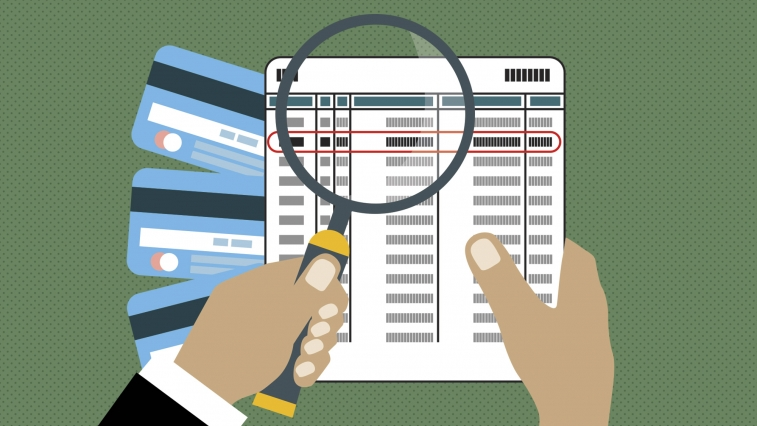

# Credit Card Fraud Detection
This repository contains a machine learning project for predicting whether a Credit Card Transaction is Fraud or Valid.

## Problem Description
Credit card companies should be to recognize fraudulent credit card transactions so that customers are not charged for items that they did not purchase. We will use various predictive models to see how accurate they are in detecting whether a transaction is a normal payment or a fraud. As described in the dataset, the features are scaled and the names of the features are not shown due to privacy reasons. Nevertheless, we can still analyze some important aspects of the dataset.

## File Description

* Credit_Card_Fraud_Detection.ipynb - Jupyter Notebook which contains python code for predicting Fraud Transactions. 
* credit_card_fraud_detection.py - Python code for predicting model. 
* Dataset- contains training and testing data. 
  * creditcard.csv - Training & Testing Data
* readme.md - for guide to this project. 

